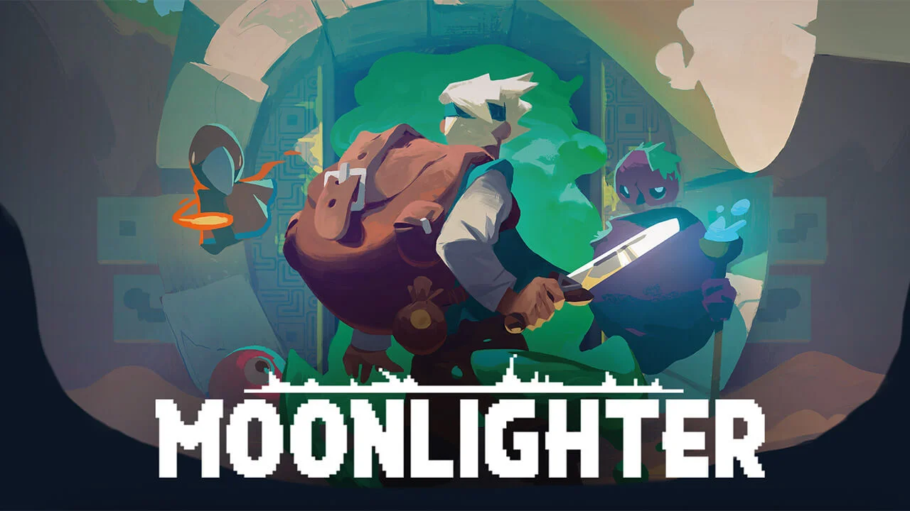

# 2025.1-Moonlighter



<div align="center">


</div>

## 🎮 Sobre o Moonlighter:

Moonlighter é um jogo indie de ação e aventura com elementos de gerenciamento, desenvolvido pela Digital Sun e lançado em 2018. Nele, você controla Will, um comerciante que vive na pacata vila de Rynoka. Durante o dia, Will cuida da sua loja, vendendo itens, ajustando preços e interagindo com os clientes. Mas à noite, ele se aventura em masmorras misteriosas em busca de tesouros, enfrentando monstros e coletando recursos raros.

O jogo chama atenção pela sua mecânica de vida dupla — equilibrando combate em tempo real com um sistema econômico de venda e precificação de itens — além de seus visuais em pixel art e trilha sonora envolvente.

### 🧪 Nosso Projeto: Moonlighter no Terminal

O projeto se baseia em uma versão adaptada e simplificada do Moonlighter, executada diretamente no terminal. A ideia é recriar a essência da rotina de Will com foco em:

- Exploração de masmorras (via menus e opções textuais)
- Coleta de itens
- Controle de inventário
- Gestão de uma loja com clientes fictícios
- Simulação de vendas e lucro

A aplicação será construída em Python (interface em terminal), com toda a lógica de dados estruturada em PostgreSQL, utilizando SQL puro para modelagem, triggers, views e controle de acesso.

##  📝 Acesse a Documentação!

O conteúdo da documentação do projeto Moonlighter aborda os assuntos e atividades cobradas durante a disciplina de Sistema de Bancos de Dados 1 da Universidade de Brasília do Campus Faculdade de Ciências e Tecnologias em Engenharia - FCTE.

Para acessar a documentação do projeto, [Clique aqui!](https://sbd1.github.io/2025.1-Moonlighter/)

## 🗃️ Estrutura do Projeto:

O projeto Moonlighter é dividido em três ambientes principais, organizados dentro da pasta `/apps`. Cada um deles cumpre um papel específico na arquitetura do sistema, mantendo o projeto modular e fácil de navegar:

- `apps/cli`: Contém o código da interface em terminal desenvolvida em Python, responsável pela interação do usuário com o sistema. Aqui é onde o jogo acontece — você executa comandos, visualiza ações e interage com o banco por meio de menus e prompts.
- `apps/sql`: Abriga toda a lógica relacionada ao banco de dados PostgreSQL, utilizando apenas SQL puro. Inclui a criação de tabelas, inserção de dados (seeds), views, triggers e controles de acesso. Esta pasta é o "coração lógico" do sistema.
- `apps/docs`: Ambiente de documentação criado com MkDocs, voltado para explicar o funcionamento do projeto, decisões de arquitetura, DER/MER, comandos SQL utilizados, e instruções de uso. É também o que será publicado no GitHub Pages para facilitar o acesso à documentação do time ou de avaliadores.

Essa organização facilita a separação entre lógica do jogo, estrutura de dados e documentação, permitindo que cada parte evolua de forma independente, mas integrada.

## 🚀 Executando o Projeto:

O projeto utiliza de pacotes JavaScript para auxiliar na execução e padronização de qualidade para o time de desenvolvimento, se restringindo apenas para este uso. Portanto, é necessário que o usuário possua Node.Js na versão 22+.

O arquivo `package.json` dispõe de comandos que auxiliam a subir os diferentes ambientes de execução separadamente:

### Rodando a Documentação 📝

Para rodar a documentação em ambiente de desenvolvimento, é necessário:

- Python3 | Versão 3.12+
- PIP | Versão 24+ (Geralmente instalado junto com o Python)

Em versões de **Windows 10+ ou Ubuntu 22.04** execute o comando:

#### 1. Instale o mkdocs:
```shell
pip install mkdocs
```
#### 2. Instale o Tema _Meterial_ do mkdocs:
```shell
pip install mkdocs-material
```
#### 3. Inicialize a documentação localmente:
```shell
npm run devDoc
```

Para usuários com o **Ubuntu na versão 24.04** ou sistemas onde o Python está configurado para **impedir a instalação de pacotes globalmente com pip**, como uma medida de segurança (PEP 668) por conta do gerenciado de pacotes padrão: `apt`, utilize os passos abaixo:

#### 1. Inicialize um Ambiente Virtual:
```shell
python3 -m venv .venv
```

#### 2. Ative o Ambiente Virtual:
Linux:
```shell
source .venv/bin/activate
```

Windows:
```shell
.venv\Scripts\Activate.ps1
```

#### 3. Instale o mkdocs:
```shell
pip install mkdocs
```

#### 4. Instale o Tema _Meterial_ do mkdocs:
```shell
pip install mkdocs-material
```
#### 5. Inicialize a documentação localmente:
```shell
npm run devDoc
```

### Rodando o Jogo 🎮

Antes de rodar o jogo, é necessário subir o banco de dados PostgreSQL. Para isso, utilizamos o Docker, que cria e gerencia o ambiente de forma isolada.

> 🛠 Pré-requisito: Certifique-se de que o Docker está instalado em sua máquina. Você pode baixá-lo em: [https://www.docker.com/products/docker-desktop](https://www.docker.com/products/docker-desktop)

##### 🚀 PASSO 1: Subindo o banco de dados
- Opção 1: Usando comandos Docker diretamente

Com o terminal aberto na raiz do projeto, execute:

```shell
docker compose up -d
```

Esse comando irá baixar as imagens necessárias e iniciar os containers do PostgreSQL e do Adminer.

- Opção 2: Usando scripts com NPM

Também na raiz do projeto, você pode subir os containers com o seguinte comando:

```shell
npm run db:up
```

Isso executa o mesmo processo anterior, mas via script definido no `package.json`, facilitando o uso para toda a equipe.

#### PASSO 2: Execute o jogo!
Após executar o PASSO 1, é necessário instalar as dependências da linguagem Python. Para isso, estando na **Raíz** do Projeto, rode o comando abaixo:

```shell
pip install -r requirements.txt
```

Agora, o seu ambiente está pronto para executar o jogo Moonlighter! Basta executar o comando abaixo:

```shell
python3 apps/cli/main.py
```

Aproveite a experiência!

## 📝 Contribua com o projeto!

Para acessar a documentação do projeto Moonlighter, [Clique Aqui](https://sbd1.github.io/2025.1-Moonlighter/) ou clique no link disponível na descrição do repositório.

O projeto utiliza o protocolo **_Coventional Commits_** nas mensagens de commit, e portanto, deve seguir o seguinte padrão:

`tipo(escopo opcional): descrição breve`

Para controle de qualidade, o projeto utiliza a biblioteca **Husky** para executar comandos verificadores em diferentes fases de interação com o Git, como o pré-commit.

Para contribuir no projeto. Realize os seguintes passos:

#### 1. Certifique de instalar as tecnologias utilizadas no projeto:

- Node.Js | Versão 22+;
- PIP | Versão 24+;
- Python3 | Versão 3+;

#### 2. Clone o Repositório:

Selecione uma pasta de sua preferência e execute o seguinte comando para clonagem do repositório:

```shell
git clone https://github.com/SBD1/2025.1-Moonlighter.git
```

#### 3. Baixe as dependências do projeto:

Para contribuir no projeto com os commits, baixe as dependências do Husky para que as verificações possam acontecer:

```shell
pip install -r apps/cli/requirements.txt
```

#### 4. Suba o serviço de sua escolha

Acesse o tópico **"Executando o projeto"** para obter detalhes de como acessar os ambientes do projeto.


---
# 👩‍💻 Contribuidores:

<!-- Foto dos participantes do grupo -->
<div align="center">
  <table>
    <tr>
      <td align="center"><a href="https://github.com/arthurevg"><br /><sub><b>231027032</b></sub></a><br /><a href="https://github.com/arthurevg" title="Rocketseat">Arthur Evangelista</a></td>
      <td align="center"><a href="https://github.com/DanielRogs"><br /><sub><b>211061583</b></sub></a><br /><a href="https://github.com/DanielRogs" title="Rocketseat">Daniel Rodrigues</a></td>
      <td align="center"><a href="https://github.com/IgorJustino"><br /><sub><b>211061897</b></sub></a><br /><a href="https://github.com/arthur-suares" title="Rocketseat">Igor Justino</a></td>
      </tr>
      <tr>
      <td align="center"><a href="https://github.com/jpaulohe4rt"><br /><sub><b>190030755</b></sub></a><br /><a href="https://github.com/jpaulohe4rt" title="Rocketseat">João Paulo</a></td>
      <td align="center"><a href="https://github.com/Yanmatheus0812"><br /><sub><b>231038303</b></sub></a><br /><a href="https://github.com/Yanmatheus0812" title="Rocketseat">Yan Matheus</a></td>
  </table>
</div>
