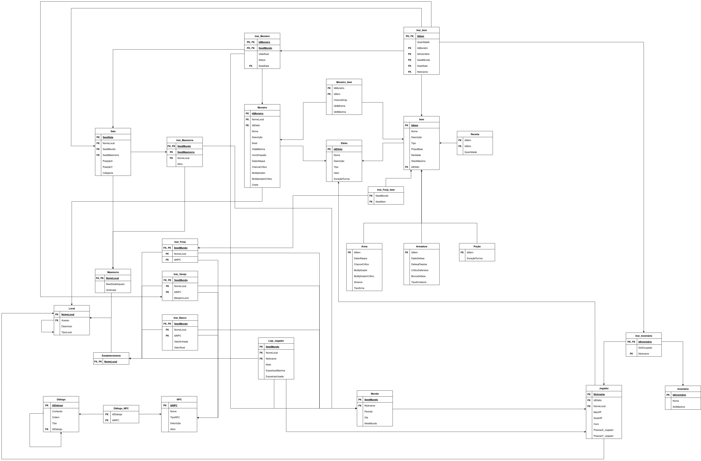

Versão 2.0

# Modelo Relacional 

## O que é o Modelo  Relacional ?
O Modelo Relacional é uma forma de representar os dados de um sistema de forma organizada e estruturada, com um nível de abstração menor que o MER. Ele é composto por tabelas, que são formadas por linhas e colunas, e relacionamentos entre essas tabelas. O Modelo Relacional é uma das formas mais comuns de representar dados em um banco de dados.

## Modelo do Relacional do Projeto:

!!! Warning "Atenção!"
    O conteúdo deste tópico **poderá sofrer alterações** ao longo da Disciplina de Sistema de Banco de Dados 1. Portanto, os Modelos Relacionais serão organizadas iniciando pela versão mais recente e finalizando com a versão mais antiga.

A seguir, está a imagem do Modelo Relacional desenvolvido para o jogo _Moonlighter_:

  Modelo Relacional | Versão 2.0

---
As versões abaixo registram Modelos de Relacionamento que foram depreciadas após análises resultantes da evolução e produção do jogo _Moonlighter_:

  Modelo Relacional | Versão 1.0

  
Figura 2: Modelo relacional Moonlighter <i>(Depreciado)</i>

  
Fonte: Autores

## Versão

| Data       | Versão | Autor(es)        | Mudanças                                                        |
| ---------- | ------ | ---------------- | --------------------------------------------------------------- |
| 01/05/2025 | `1.0`  | Igor  Justino    | Desenvolvimento da página de documentação de Modelo Relacional  |
| 11/06/2025 | `2.0`  | Daniel Rodrigues | Inserção da nova versão do Modelo Relacional  |
